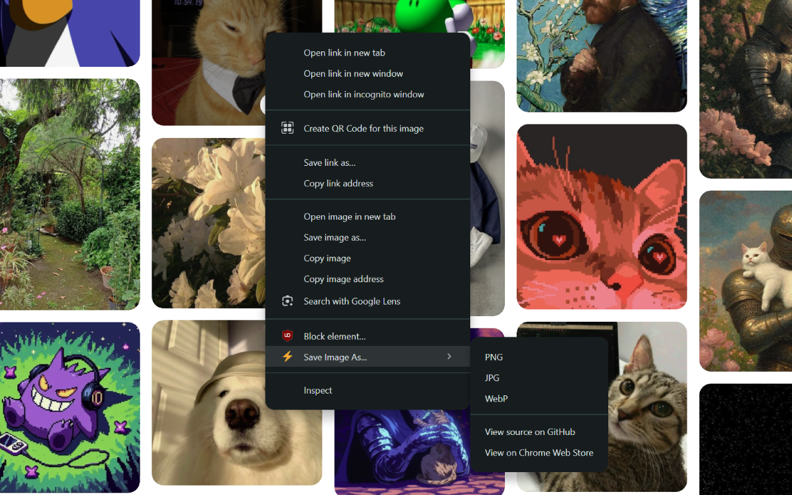

# Save Image As...

A simple Chrome extension that lets you save any image from the web as **PNG**, **JPG**, or **WebP** — directly from the right-click menu.

## 📸 Screenshots

## 🛒 Available on the Chrome Web Store

Install the extension directly from the Chrome Web Store:

## 🧩 Features

- Save any image in **PNG**, **JPG**, or **WebP** format
- Works via right-click (context menu)
- Automatically handles:
  - CORS restrictions (where possible)
  - Intelligent filename fallback if original name is not available
- Language support (i18n):
  - 🇺🇸 English
  - 🇧🇷 Portuguese
- Additional menu options:
  - Open source on GitHub
  - View extension on Chrome Web Store

## 🌐 Localization

This extension is available in:

- 🇺🇸 English (`en`)
- 🇧🇷 Portuguese (`pt`)

## 📥 Installation (Development Mode)

1. Clone or download this repository
2. Open `chrome://extensions/` in Google Chrome
3. Enable **Developer mode** (top right)
4. Click **Load unpacked**
5. Select the project directory

## 📝 License

This project is licensed under the [MIT License](LICENSE).

---

Made with ❤️ by [Gabriel de Rezende Gonçalves](https://gabireze.com.br)

<!-- GitAds-Verify: XST1ZQHQTE5U1XA4472UHKK14D2TDX9B -->
